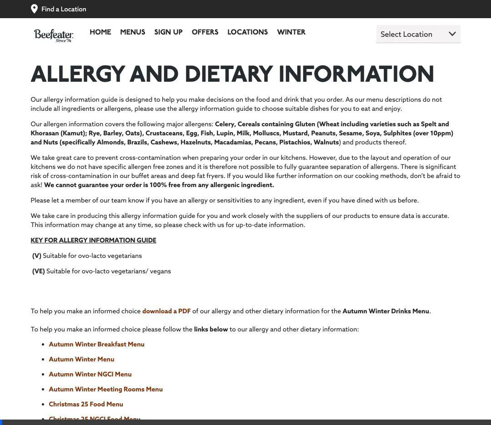

# Walkthrough - Menu Tracker Improvements

## Beefeater Scraper Refinement (Debug)

Fixed critical item extraction issues caused by recent DOM changes on the Beefeater website.

### Fixes & Refinements
- **Dynamic Discovery**: The script now collects active menu links and their **human-readable names** (e.g., "Autumn Winter Breakfast Menu") from the `<b>` tags in the navigation cards.
- **Improved Metadata Labels**:
    - **menu_name**: No longer uses the URL IDs; it captures the full descriptive title of the menu.
    - **menu_section**: Correctly maps content containers to their display labels (e.g., "PREMIER INN BREAKFAST" or "74 Sauces"). Fixed the mapping logic by removing outdated `tab-` prefixes.
- **Improved Item Targeting**: Switched to targeting `div.dish_Content` as the primary container for food items.
- **Refined Selectors**:
    - **Name**: `.dishDetails_P.handle label`
    - **Allergens**: `span.dishContains_P2` & `span.dishMayContains_P2`
    - **Nutrition**: `table.NandATable` inside `div.ExColContent`.

### Verification (Logic)
- **Metadata**: Verified parity with the Zizzi reference format by ensuring both menu and section fields are fully descriptive.
- **Traversal**: Verified that item names and their corresponding detail containers are correctly associated in the new hierarchy.

---
 

*Recording of the debug exploration showing the new Beefeater DOM structure.*
