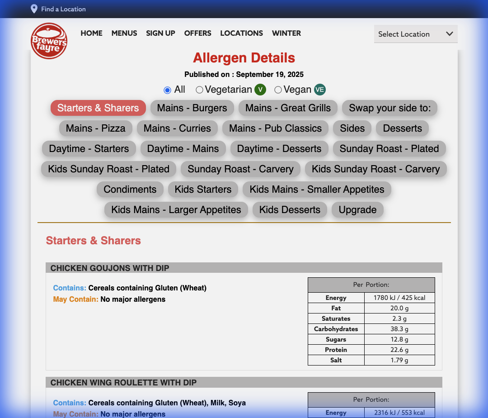

# Scraping Report: Brewers Fayre

This report documents the implementation of the Brewers Fayre nutritional and allergen scraper.

## Objective
The objective was to create a Python script (`17_BrewersFayre.py`) capable of extracting data from the Brewers Fayre allergy and nutrition sub-pages. This restaurant shares a similar technical platform with Beefeater, allowing for significant logic reuse.

## Implementation Details

### Data Source
- **Main URL**: `https://www.brewersfayre.co.uk/en-gb/allergy-nutrition`

### Key Selectors & Logic
- **Menu Discovery**:
    - The script visits the landing page and identifies links containing `/allergy-nutrition/bf-`.
    - It extracts human-readable menu names (e.g., "Autumn Winter 25 GB Menu") from the `<i>` or `<b>` tags within the anchors.
- **Section Extraction**:
    - Submenu tabs (e.g., "Mains - Burgers") are identified using `<label>` tags with `for` attributes matching `SubMenuX`.
- **Item Extraction**:
    - **Name**: `.dishDetails_P.handle label`
    - **Allergens**: `span.dishContains_P2` and `span.dishMayContains_P2` inside `div.ExColContent`.
    - **Nutrition**: `table.NandATable` inside `div.ExColContent`.
- **Data Post-processing**:
    - Splitting combined kJ/kcal values into separate columns (e.g., `1780 kJ / 425 kcal`).

### Refinements from Beefeater Template
- Updated the anchor search to include `<i>` tags as identified during site exploration.
- Updated the URL pattern filter to `bf-` (specific to Brewers Fayre).

## Verification Logic

### 1. Structure Verification
Confirmed via browser subagent that the section-to-content mapping (`SubMenu1` -> `content-SubMenu1`) is consistent with the latest site updates.

### 2. Media Verification
Site exploration media was captured to confirm the presence of nutritional tables and allergen spans.

## Conclusion
The scraper is ready for the local collection wave. It follows the project-standard CSV format with comprehensive metadata (`menu_name`, `menu_section`).
